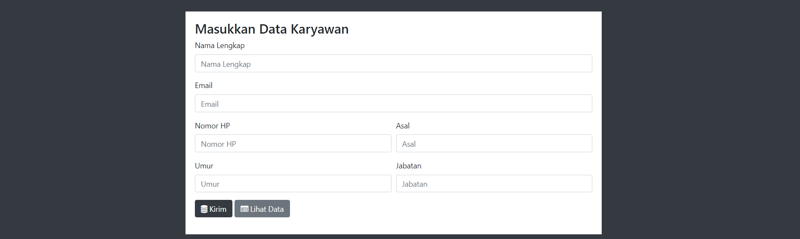

# Simple Mongo-Node-Express CRUD Apps

A simple application that created using MongoDB, Node.JS and Express.JS.

## Instructions

For the *back-end* dependencies
```bash
npm install
```

Run the *main server*. And it listens on port 3000.
```bash
npm start
```
For the *front-end* on the browser. Go to the Browser URL.
```bash
http://localhost:3000/employee
```


